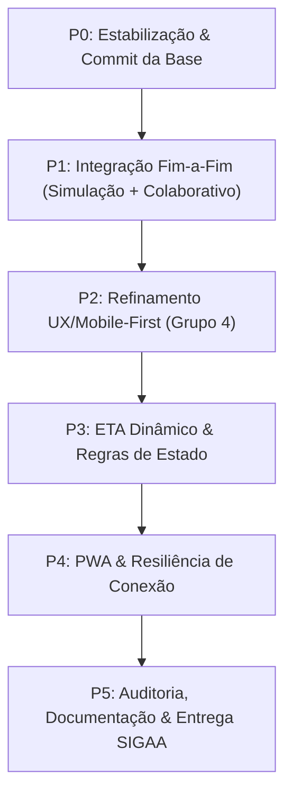

# 🗺️ ROTEIRO TÉCNICO PRIORIZADO — LOCBUS PoC (2026)

> **Documento Estratégico de Execução**: Alinhado à *Atividade Substitutiva de Desenvolvimento do PoC* e à frente de trabalho de *Frontend & UX (Grupo 4)* com interfaces de integração com Backend, Telemetria e Testes.

---

## 🎯 Visão Sintética por Níveis de Prioridade

---

## 🔴 PRIORIDADE 0 (P0) — Estabilização, Baseline & Git (Imediato)
*Objetivo: Garantir que nenhuma alteração em andamento seja perdida e que o ambiente de testes esteja 100% reprodutível.*

1. **Revisar e consolidar as alterações ativas no Git (Working Tree)**:
   - [ ] Confirmar a expansão de 31 waypoints da rota circular (`app/main.py`).
   - [ ] Confirmar os novos botões e controles de velocidade na simulação (`app/static/js/simulation.js` e `app/Templates/index.html`).
   - [ ] Confirmar as melhorias no Leaflet (`app/static/js/map.js` e `style.css`).
   - [ ] Fazer commit atômico dessas mudanças: `feat: rota circular completa (ida e volta) e controles interativos de simulacao`.
2. **Garantir Execução Padrão dos Testes**:
   - [ ] Adicionar arquivo de configuração `pytest.ini` na raiz contendo `pythonpath = .` para permitir execução direta via `pytest` sem depender de `python -m`.

---

## 🟠 PRIORIDADE 1 (P1) — Ciclo Fim-a-Fim: Crowdsourcing & Telemetria em Tempo Real
*Objetivo: Validar que o ônibus é rastreado continuamente durante o trajeto sem depender de hardware caro embarcado.*

1. **Validação do Fluxo de Crowdsourcing no Frontend (`crowdsource.js`)**:
   - [ ] Verificar gatilho de permissão de geolocalização (`navigator.geolocation.watchPosition`).
   - [ ] Validar o mecanismo de *throttling* (amostragem a cada 10s-15s para não drenar bateria nem consumir dados móveis).
   - [ ] Exibir indicador visual pulsante ("Transmitindo localização do ônibus...") enquanto ativo.
2. **Validação do Pipeline no Backend (`app/services.py` & `app/main.py`)**:
   - [ ] Endpoint `POST /api/v1/telemetry/collaborative`:
     - Validação de payload Pydantic (`CollaborativeIn`: lat, lon, precisão, velocidade, timestamp).
     - Filtro de Geofencing: descartar pontos com desvio > 80m da rota ou velocidade espúria (> 65 km/h).
     - Buffer volátil com descarte automático (TTL <= 5 min / descarte após chegada no ponto).
     - Clustering espacial: fusão ponderada pelo inverso da acurácia quando múltiplos passageiros transmitem.
3. **Transmissão em Tempo Real via Server-Sent Events (SSE)**:
   - [ ] Testar canal `/api/v1/stream` para transmissão instantânea da posição consolidada ao mapa do usuário que está esperando no ponto.

---

## 🟡 PRIORIDADE 2 (P2) — Frontend & Experiência do Usuário (Entrega Núcleo Grupo 4)
*Objetivo: Cumprir integralmente o plano de 7 dias do Grupo 4 especificado no SIGAA.*

1. **Botão de Ação Rápida no Dashboard ("Estou a bordo • Compartilhar Trajeto")**:
   - [ ] Posicionamento em destaque acessível com 1 polegar (Design Mobile-First).
   - [ ] Estados visuais claros: *Inativo*, *Aguardando GPS*, *Ativo / Transmitindo*, *Erro de Permissão*.
2. **Modal de Consentimento e Privacidade (LGPD)**:
   - [ ] Criar modal explicando a coleta anônima, sem login e sem retenção de identificadores pessoais.
   - [ ] Botão explícito de "Concordar e Iniciar" e "Agora não".
3. **Painel de Transparência e Confiabilidade dos Dados**:
   - [ ] Exibir etiqueta visual com a fonte do dado atual:
     - 🟢 *Presença física confirmada no ponto (BLE)*
     - 🔵 *Localização colaborativa em trânsito (X passageiros a bordo)*
     - 🟡 *Posição estimada pelo tempo médio decorrido*
     - ⚪ *Aguardando próxima partida*
   - [ ] Exibir contador "Atualizado há X segundos".

---

## 🟢 PRIORIDADE 3 (P3) — ETA Dinâmico & Máquina de Estados Operacional
*Objetivo: Oferecer previsibilidade confiável para quem aguarda nas paradas.*

1. **Cálculo Dinâmico de ETA**:
   - [ ] Substituir estimativas estáticas por cálculo em função da distância restante e velocidade média da via.
   - [ ] Considerar tempo de parada nos terminais (CCHLA e CI).
2. **Máquina de Estados Operacional**:
   - [ ] Implementar formalmente as transições de estado:
     - `PARADO_PONTO`
     - `EM_TRANSITO_COLABORATIVO`
     - `EM_TRANSITO_ESTIMADO`
     - `INATIVO / FORA_DE_OPERACAO`
   - [ ] Transmitir o estado atual no payload SSE para atualização imediata dos cards da interface.

---

## 🔵 PRIORIDADE 4 (P4) — PWA, Resiliência & Funcionamento Offline
*Objetivo: Garantir que o aplicativo funcione como um Web App instalável e tolere quedas momentâneas de sinal celular.*

1. **Validação do Web App Manifest e Service Worker**:
   - [ ] Ícones nas resoluções corretas (192px, 512px, maskable).
   - [ ] Suporte a "Adicionar à tela de início" no Android/iOS sem passar por lojas.
2. **Tratamento de Desconexão no Frontend**:
   - [ ] Notificação discreta quando a conexão SSE ou a rede cair.
   - [ ] Reconexão automática com backoff exponencial.

---

## 🟣 PRIORIDADE 5 (P5) — Documentação, Auditoria & Entrega SIGAA
*Objetivo: Fechar a entrega acadêmica e institucional com excelência.*

1. **Atualização do Documento da Atividade**:
   - [ ] Revisar [Atividade_PoC_LocBUS_Guilherme_Guedes.html](file:///e:/prof3/Atividade_PoC_LocBUS_Guilherme_Guedes.html) incorporando capturas e evidências reais da PoC.
   - [ ] Gerar versão final atualizada em PDF.
2. **Evidências de Teste**:
   - [ ] Gerar relatório de execução dos testes com 100% de sucesso.
   - [ ] Gravar/demonstrar o fluxo da simulação completa com a rota circular.
